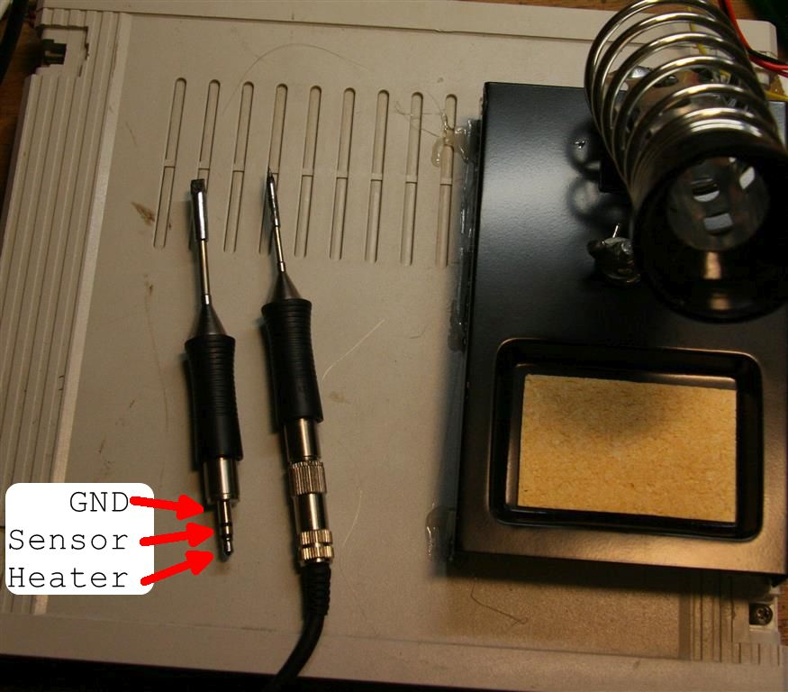
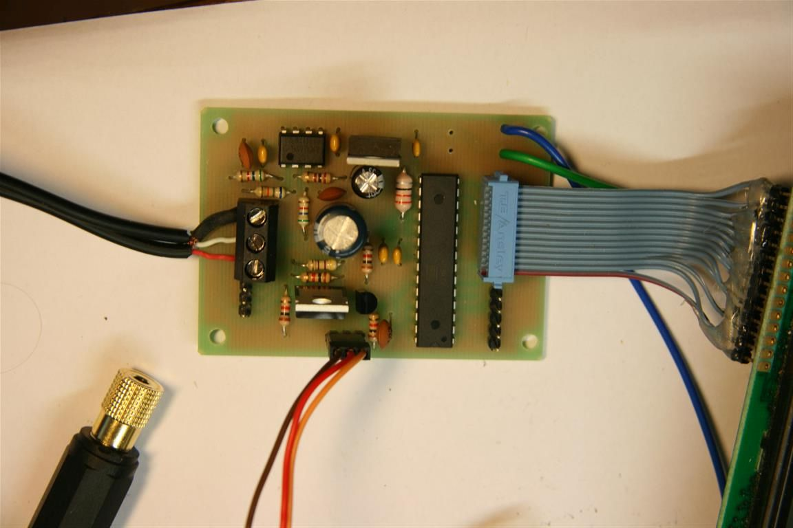
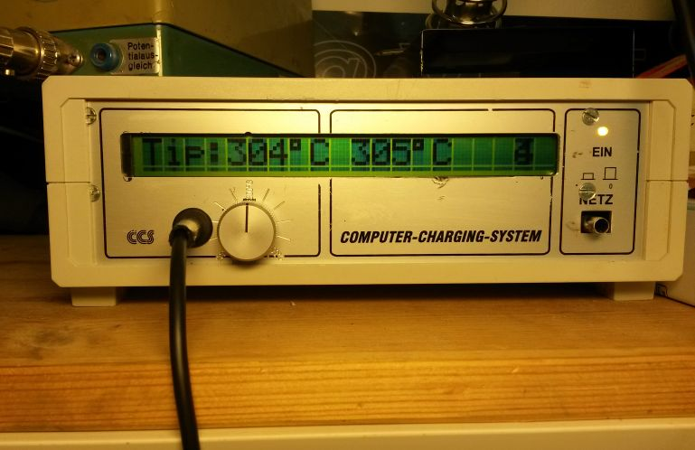
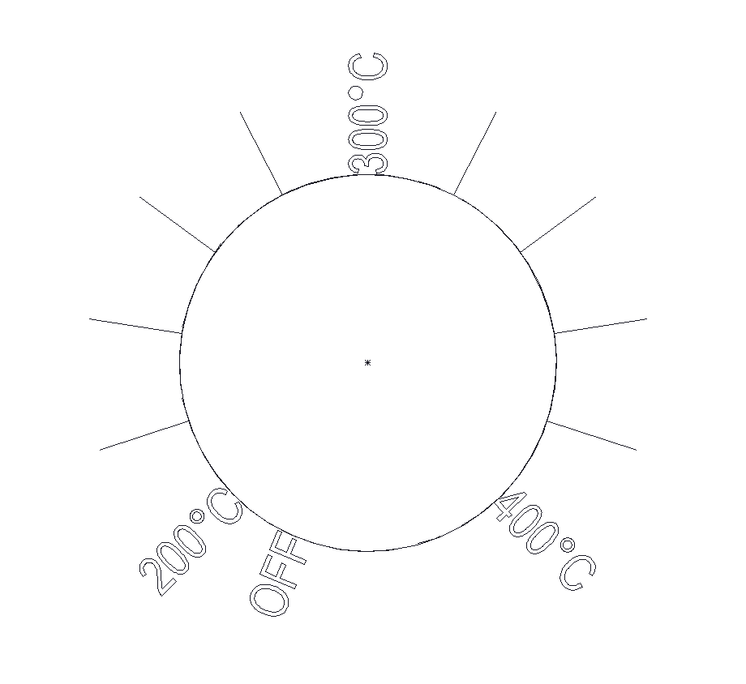
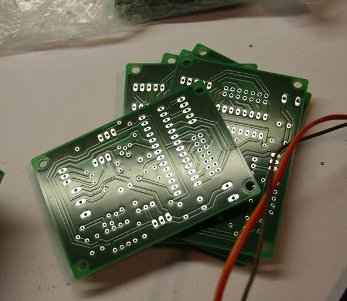
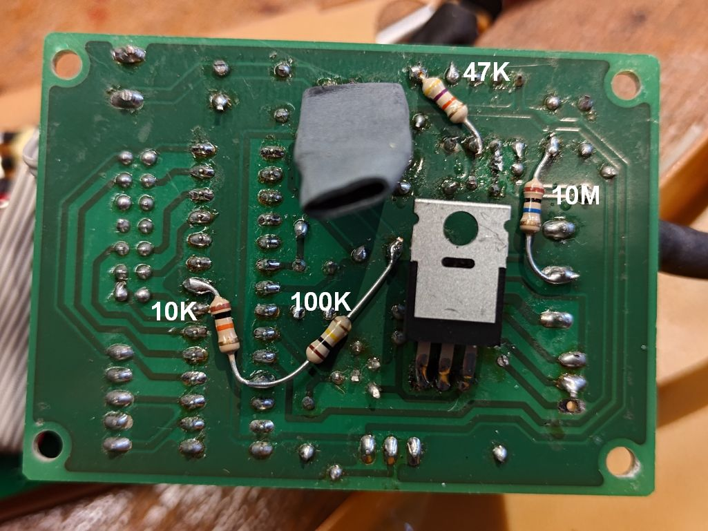

# Soldering Station for Weller Soldering Tips



https://www.weller-tools.com/eu/de/industrielles-loeten/produkte/loetspitzen/rtm-013-s

Power or Battery supply 10-14V DC up to 3A or so needed.

This project is based on the work of Martin Kumm.

http://www.martin-kumm.de/wiki/doku.php?id=Projects:SMD_Solderstation

I made it simpler and cheaper. Instead of using an Arduino I use a ATmega8. This design doesn't use SMD instead a single sided PCB for easy assembly and cheap PCB production. The PCB is only 70x50mm. Instead of using two buttons to adjust the temperature I use a poti and optionally you can use a standard HD44780 compatible LCD to display temperatures. It runs on plain c (no arduino) and also includes supports a bootloader for easy firmware upgrade. The Bootloader has to be programmed befor soldering the mega8 into the PCB. The bootloader is activaded using the Boot pins on the PCB (short PD2 to ground)

http://mlaiacker.mooo.com/Elektronik/Soldering%20Station/

http://fpv-community.de/showthread.php?41335-DIY-SMD-L%F6tstation-Ersatz-f%FCr-%28WELLER%29

## PCB layout


[board layout pdf hardware/eagle/rt_solder_simple_V1.2.brd.pdf](hardware/eagle/rt_solder_simple_V1.2.brd.pdf?raw=true)


## Bill of Materials for PCB

[BOM as pdf](hardware/eagle/rt_solder_simple_V1.2.BOM.pdf?raw=true)


| Qty | Value        | Device          | Package      | Parts                | Description                 | Comment                       | Link |
| --- | ------------ | --------------- | ------------ | -------------------- | --------------------------- | ----------------------------- | ---- |
| 3   | 10nF         | C-EU050-035X075 | C050-035X075 | C6, C7, C8           | CAPACITOR,                  |                               |      |
| 5   | 100nF        | C-EU050-035X075 | C050-035X075 | C3, C4, C9, C10, C11 | CAPACITOR,                  |                               |      |
| 1   | TLC27L2ACP   | TLC27L2ACP      | DIL08        | IC3                  | DUAL OPERATIONAL AMPLIFIERS |                               |      |
| 1   | 22µH or 10R  | L-EU0207/10     | 0207/10      | L1                   | INDUCTOR,                   |                               |      |
| 1   | BOOT         | JP1E            | JP1          | JP2                  | JUMPER                      | to enable bootloader          |      |
| 1   | MEGA8-P      | MEGA8-P         | DIL28-3      | IC1                  | MICROCONTROLLER             | needs bootloader              |      |
| 1   | 2N7000 N-CH  | VN2222KM        | TO237        | Q1                   | N-Channel MOSFET            |                               |      |
| 1   | IRF5305 P-CH | IRF9530         | TO220BV      | Q3                   | P-CHANNEL POWER-MOS-FET     |                               |      |
| 1   | LCD          | PINHD-2X7       | 2X07         | JP1                  | PIN HEADER                  | optional                      |      |
| 1   | LED          | MA03-1          | MA03-1       | SV4                  | PIN HEADER                  |                               |      |
| 1   | POTI         | MA03-1          | MA03-1       | SV1                  | PIN HEADER                  | Poti to set temperatur 1K-50K |      |
| 1   | UART         | MA03-1          | MA03-1       | SV2                  | PIN HEADER                  | optional                      |      |
| 1   | 4.7µF 10V    | CPOL-EUE2.5-6   | E2,5-6       | C1                   | POLARIZED CAPACITOR         |                               |      |
| 2   | 470µF 16V    | CPOL-EUE3.5-10  | E3,5-10      | C2, C5               | POLARIZED CAPACITOR,        |                               |      |
| 1   | 100R         | R-EU_0207/10    | 0207/10      | R6                   | RESISTOR,                   |                               |      |
| 1   | 470R         | R-EU_0207/10    | 0207/10      | R2                   | RESISTOR,                   |                               |      |
| 1   | 68k          | R-EU_0207/10    | 0207/10      | R5                   | RESISTOR,                   |                               |      |
| 2   | 5k6          | R-EU_0207/10    | 0207/10      | R4, R7               | RESISTOR,                   |                               |      |
| 4   | 1k           | R-EU_0207/10    | 0207/10      | R3, R8, R11, R12     | RESISTOR,                   |                               |      |
| 1   | 47k          | R-EU_0207/10    | 0207/10      | bodge                | RESISTOR,                   | to fix tmperature measurement |      |
| 1   | 10M          | R-EU_0207/10    | 0207/10      | bodge                | RESISTOR,                   | to fix tmperature measurement |      |
| 1   | 10k          | R-EU_0207/10    | 0207/10      | bodge                | RESISTOR,                   | to add voltage measurement |      |
| 1   | 100          | R-EU_0207/10    | 0207/10      | bodge                | RESISTOR,                   | to add voltage measurement |      |
| 1   | 78L05        | 78XXS           | 78XXS        | IC2                  | VOLTAGE REGULATOR           |                               |      |
| 1   | POWER        | W237-02P        | W237-132     | X1                   | WAGO SREW CLAMP             | optional                      |      |
| 1   | Solder       | W237-3E         | W237-3E      | X2                   | WAGO SREW CLAMP             | optional                      |      |

## Images

PCB<br>
 <br>
With nice enclosure and LCD<br>
 <br>
You can also just use this scale to set the temperature instead of the LCD
 <br>
Ask me for PCBs !! I had 10 made and some are available<br>
 <br>

## FAQ

### Hast du noch Platinen? 

ja noch: <br>
10 (2.4.2016)<br>
9 (5.4.2016)<br>
Ich kann auch gleich programmierten atmega8 und OPA und LCD dazu legen

### Was Kostet? 
10

### hex bauen?

```
make all
```

Das erstellen der main.hex geht über das Makefile mit "make all" dazu musst du den gcc avr Compiler installiert haben siehe dazu :http://www.mikrocontroller.net/articles/AVR-GCC

### flashen?

[for atmega 168](software/avr/main_atmega168.hex)

[for atmega 8](software/avr/main_atmega8.hex)

```
make program
```

Mit "make program" wird dann avrdude aufgerufen um über die serielle Schnittstelle ein neues Programm zu laden.
Dazu musst du wahrscheinlich den Port (com1) ändern im Makefile

```
AVRDUDE_PORT = com1 -b 38400 # programmer connected to serial device
```

Computer per TTL Seriell mit der Platine verbinden einen jumper auf die "Boot" pins stecken und einschalten dann wird der Bootloader aktiviert.

### bootloader ?

kopliziert. mit extra Adapter per ISP und dann mit "make programm_all" im bootloader Ordner. (avrdude und DIAMEX USB ISP bei mir)

### Wo bekomme ich IC3 her?

TLC 272 DIP bei reichelt

### Temperatur stimmt nicht

Die auf dem Display angezeigte Temperatur ist zu hoch bzw entspricht nicht der an der Lötspitze gemessenen. 
Bitte einen 47k Widerstand von Pin 3 an IC3 nach Masse löten und neue Software laden und wenn nötig
```C
#define TEMP_GAIN	(4980L)
#define TEMP_OFFSET	(-8)
```
anpassen.

 <br>
